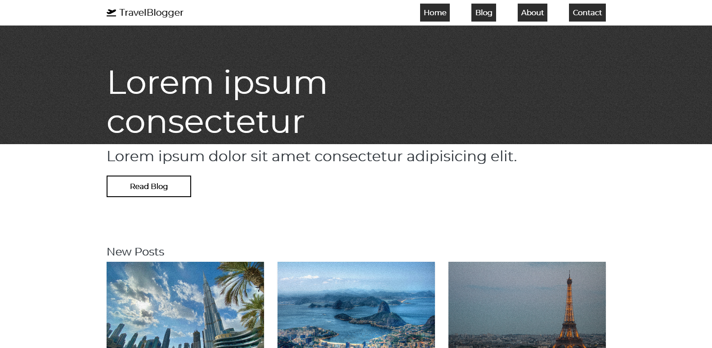
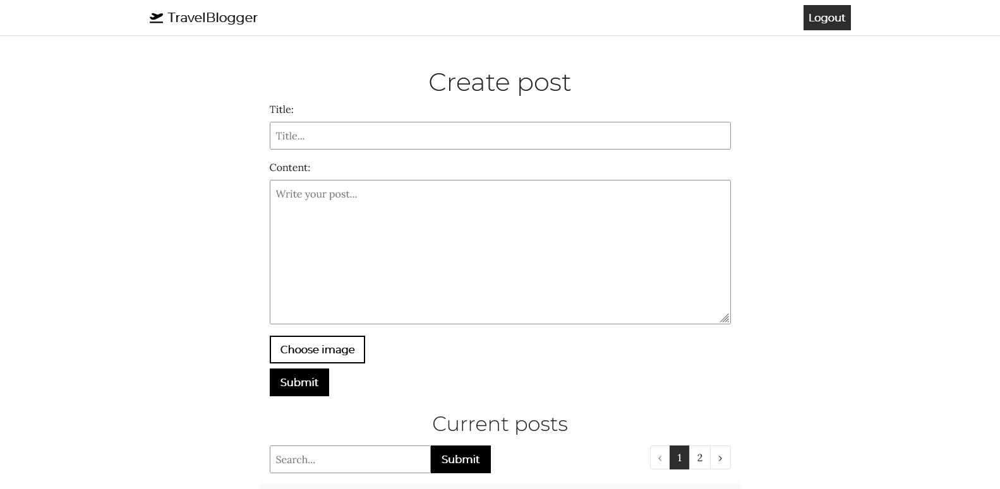

## About

A CRUD Blog application built with Laravel for the course MVC at Blekinge Tekniska Högskola.

The application has a visitor interface and an admin interface. It is possible to go to the admin interface through the path "/admin" and login with the username "admin@admin.com" and password "password". Here you can create, update and delete blog posts. Each blog post requires that all fields are filled in and an image is provided.

